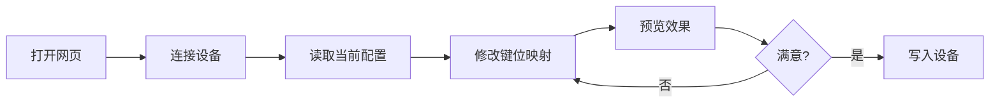

# 改键软件使用文档（Web 版）

> 基于 Vue 3 开发的在线键盘改键工具，支持通过浏览器直接配置键盘映射

## ✨ 功能特性

- 🎹 **键盘键位映射** - 自定义任意按键功能
- 🎵 **多媒体键映射** - 支持音量、播放等媒体控制键
- 🖱️ **鼠标键位映射** - 配置鼠标按键行为
- 🔌 **设备自动识别** - 支持多款硬件设备即插即用
- 💾 **配置读写** - 保存和加载键位映射配置
- 🌐 **纯 Web 方案** - 无需安装任何驱动或客户端

## 📋 前置要求

### 浏览器兼容性

| 浏览器 | 版本要求 | WebHID 支持 | 推荐程度 |
|--------|---------|------------|---------|
| Chrome | ≥ 89 | ✅ | ⭐⭐⭐⭐⭐ |
| Edge | ≥ 89 | ✅ | ⭐⭐⭐⭐⭐ |
| Opera | ≥ 75 | ✅ | ⭐⭐⭐⭐ |
| Firefox | - | ❌ | ❌ |
| Safari | - | ❌ | ❌ |

> ⚠️ **重要提示**：本工具依赖 WebHID API，仅支持 Chromium 内核浏览器（Chrome、Edge、Opera 等）

### 系统要求

- Windows 10/11、macOS 10.15+、Linux（Ubuntu 20.04+）
- 支持 USB HID 协议的键盘设备
- HTTPS 连接（本地开发可使用 `localhost`）

## 🚀 快速开始

### 在线使用

访问在线改键页面，按照以下步骤操作：

1. **连接设备**
   - 点击"连接设备"按钮
   - 在弹出的设备选择框中选择你的键盘
   - 授权浏览器访问 USB 设备

2. **配置键位**
   - 选择要修改的源键位
   - 设置映射的目标键位
   - 点击"保存"按钮

3. **写入配置**
   - 确认配置无误后点击"写入设备"

> 💡 **提示**：首次连接设备时需要手动授权，后续访问会自动记住设备权限

## 🛠️ 自部署指南

### 方式一：构建生产版本

#### 1. 克隆项目并安装依赖

```bash
cd Software/binary-keyboard-studio-ui

# 安装依赖（推荐使用 pnpm）
pnpm install
```

#### 2. 构建生产版本

```bash
# Vue 3 + Vite 构建命令
pnpm build

# 构建产物位于 dist 目录
```

构建完成后，`dist` 目录结构示例：
```
dist/
├── assets/
│   ├── index-[hash].js
│   └── index-[hash].css
├── index.html
└── favicon.ico
```

#### 3. 部署到静态服务器
可选择Nginx、Apache等静态服务器，或使用GitHub Pages、Vercel等托管服务。

### 方式二：本地开发服务器

```bash
# 开发模式（支持热重载）
pnpm dev

# 访问 http://localhost:5173
```

> ⚠️ **HTTPS 要求**：WebHID API 要求 HTTPS 连接，本地开发时 `localhost` 可以免除此限制

## 📖 使用说明

### 基本操作流程




### 进阶功能

#### 组合键配置
- 支持配置 `Ctrl/Alt/Shift/Win + 其他键` 的组合
- 可实现自定义快捷键功能

## ❓ 常见问题

### Q: 为什么无法连接设备？

**A:** 请检查以下项目：
1. ✅ 使用 Chrome/Edge 浏览器（≥ 89 版本）
2. ✅ 网站使用 HTTPS 协议（或为 localhost）
3. ✅ 键盘已正确连接到电脑
4. ✅ 没有其他程序占用设备（如其他改键软件）
5. ✅ 浏览器已授权 USB 设备访问权限
6. ✅ 确保键盘已经成功下载最新固件

### Q: 能否恢复默认键位？

**A:** 可以，有以下方式：
- 重新刷写键盘固件，并选择清空DataFlash


### Q: 网页关闭后配置会丢失吗？

**A:** 不会，配置已写入键盘硬件，除非：
- 清空DataFlash
- 没有成功写入配置

## 🔧 技术栈

- **框架**: Vue 3 (Composition API)
- **构建工具**: Vite
- **核心 API**: WebHID API
- **UI 组件**: Element Plus
- **状态管理**: Pinia

## 🤝 贡献指南

欢迎提交 Issue 和 Pull Request！

### 开发环境设置

```bash
# 1. Fork 并克隆项目
git clone https://github.com/your-username/project.git

# 2. 安装依赖
pnpm install

# 3. 启动开发服务器
pnpm dev

# 4. 运行测试（如有）
pnpm test
```

### 代码规范

- 使用 ESLint + Prettier 格式化代码
- 提交前运行 `pnpm lint` 检查
- Commit 信息遵循 [Conventional Commits](https://www.conventionalcommits.org/)

## 📄 许可证

MIT License - 详见 [LICENSE](LICENSE) 文件

## 🔗 相关链接

- [WebHID API 文档](https://developer.mozilla.org/en-US/docs/Web/API/WebHID_API)
- [Vue 3 官方文档](https://vuejs.org/)
- [Vite 官方文档](https://vitejs.dev/)

---

**⚡ 快速反馈**: 遇到问题？[提交 Issue](issues)